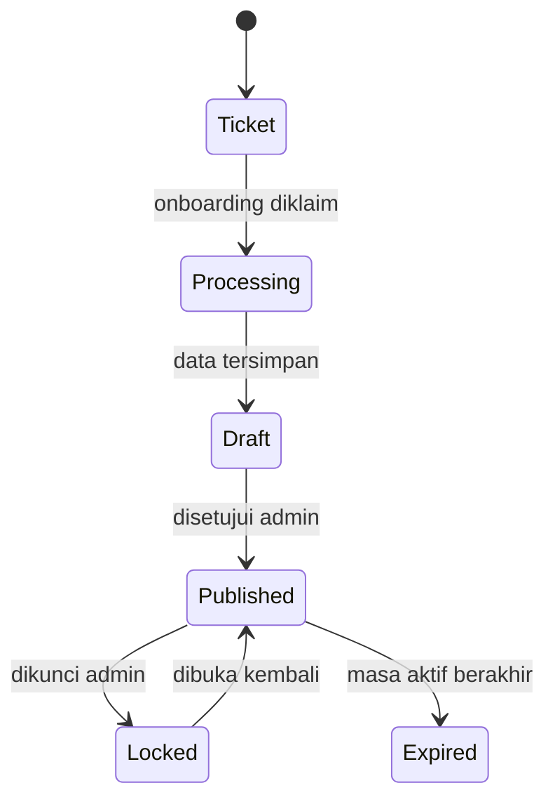

# Model Data V2

Dokumen ini membedakan fakta legacy dari target V2. Schema final harus diwujudkan sebagai migration Supabase sebelum deployment.

## Entitas inti

| Entitas | Tujuan | Catatan keamanan |
|---|---|---|
| `invitations` | Identitas undangan, pasangan, acara, tema, tier, lifecycle | Kolom publik dan rahasia harus dipisahkan melalui view/DTO |
| `bank_accounts` | Rekening milik satu undangan | Wajib terikat `invitation_id` dan batas tier |
| `galleries` | Media galeri serta posisi | Wajib terikat `invitation_id` dan ownership Cloudinary |
| `guestbook` | RSVP dan pesan tamu | Operasi baca/tulis harus dibatasi ke undangan yang benar |
| `settings` | Profil bisnis non-rahasia | Password tidak boleh disimpan di tabel ini |

## Lifecycle target

## Field rahasia

Field berikut tidak boleh berada dalam payload halaman publik:

- Primary key internal.
- Onboarding token.
- Edit token atau hash-nya.
- Catatan internal admin.
- Service-role key, password hash, atau konfigurasi vendor.

## Constraints target

- `slug` unik dan tervalidasi.
- Token onboarding/edit unik, dapat dicabut, memiliki expiry, dan idealnya disimpan sebagai hash.
- Foreign key menggunakan cascade/restrict yang eksplisit.
- Status lifecycle dibatasi enum/check constraint.
- Claim token onboarding bersifat atomik.
- Penyimpanan invitation dan relasinya dilakukan dalam transaksi/RPC.
- `published_at`, `expires_at`, `created_at`, dan `updated_at` dicatat oleh database.
- RLS deny-by-default diuji untuk anon, authenticated, dan service role.

## Status implementasi

DTO publik, validasi ID/token, serta penegakan tier sudah tersedia pada branch fondasi. Migration, transaksi database, token hash/expiry, dan test RLS masih menjadi checkpoint berikutnya.
